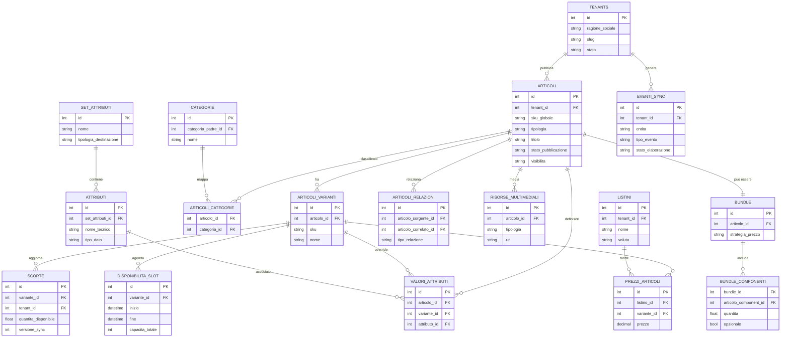

# ER diagramma – Hub centrale (catalogo e marketplace)

```mermaid
erDiagram
    TENANTS ||--o{ ARTICOLI : "pubblica"
    ARTICOLI ||--o{ ARTICOLI_VARIANTI : "ha"
    ARTICOLI ||--o{ VALORI_ATTRIBUTI : "definisce"
    ARTICOLI ||--o{ ARTICOLI_CATEGORIE : "classificato"
    ARTICOLI_VARIANTI ||--o{ VALORI_ATTRIBUTI : "override"
    ARTICOLI_VARIANTI ||--o{ SCORTE : "aggiorna"
    ARTICOLI_VARIANTI ||--o{ PREZZI_ARTICOLI : "valutato"
    ARTICOLI_VARIANTI ||--o{ DISPONIBILITA_SLOT : "agenda"
    ARTICOLI ||--|| BUNDLE : "puo essere"
    BUNDLE ||--o{ BUNDLE_COMPONENTI : "include"
    ARTICOLI ||--o{ ARTICOLI_RELAZIONI : "relaziona"
    ARTICOLI ||--o{ RISORSE_MULTIMEDIALI : "media"
    SET_ATTRIBUTI ||--o{ ATTRIBUTI : "contiene"
    ATTRIBUTI ||--o{ VALORI_ATTRIBUTI : "associato"
    CATEGORIE ||--o{ ARTICOLI_CATEGORIE : "mappa"
    LISTINI ||--o{ PREZZI_ARTICOLI : "tariffe"
    TENANTS ||--o{ EVENTI_SYNC : "genera"

    TENANTS {
        int id PK
        string ragione_sociale
        string slug
        string stato
    }

    ARTICOLI {
        int id PK
        int tenant_id FK
        string sku_globale
        string tipologia
        string titolo
        string stato_pubblicazione
        string visibilita
    }

    ARTICOLI_VARIANTI {
        int id PK
        int articolo_id FK
        string sku
        string nome
    }

    SET_ATTRIBUTI {
        int id PK
        string nome
        string tipologia_destinazione
    }

    ATTRIBUTI {
        int id PK
        int set_attributi_id FK
        string nome_tecnico
        string tipo_dato
    }

    VALORI_ATTRIBUTI {
        int id PK
        int articolo_id FK
        int variante_id FK
        int attributo_id FK
    }

    CATEGORIE {
        int id PK
        int categoria_padre_id FK
        string nome
    }

    ARTICOLI_CATEGORIE {
        int articolo_id FK
        int categoria_id FK
    }

    BUNDLE {
        int id PK
        int articolo_id FK
        string strategia_prezzo
    }

    BUNDLE_COMPONENTI {
        int bundle_id FK
        int articolo_component_id FK
        float quantita
        bool opzionale
    }

    ARTICOLI_RELAZIONI {
        int id PK
        int articolo_sorgente_id FK
        int articolo_correlato_id FK
        string tipo_relazione
    }

    SCORTE {
        int id PK
        int variante_id FK
        int tenant_id FK
        float quantita_disponibile
        int versione_sync
    }

    LISTINI {
        int id PK
        int tenant_id FK
        string nome
        string valuta
    }

    PREZZI_ARTICOLI {
        int id PK
        int listino_id FK
        int variante_id FK
        decimal prezzo
    }

    DISPONIBILITA_SLOT {
        int id PK
        int variante_id FK
        datetime inizio
        datetime fine
        int capacita_totale
    }

    RISORSE_MULTIMEDIALI {
        int id PK
        int articolo_id FK
        string tipologia
        string url
    }

    EVENTI_SYNC {
        int id PK
        int tenant_id FK
        string entita
        string tipo_evento
        string stato_elaborazione
    }
```
