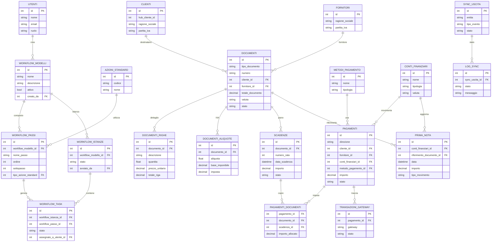

# ER diagramma – Tenant (workflow, documenti, pagamenti)

Vedi anche: `docs/diagrammi/overview-multi-tenant.md` per una panoramica a livelli (LPWF → Tenant → Clienti/Risorse).

```mermaid
erDiagram
    UTENTI ||--o{ WORKFLOW_MODELLI : "crea"
    WORKFLOW_MODELLI ||--o{ WORKFLOW_PASSI : "composto"
    WORKFLOW_MODELLI ||--o{ WORKFLOW_ISTANZE : "istanza"
    WORKFLOW_PASSI ||--o{ WORKFLOW_TASK : "genera"
    WORKFLOW_ISTANZE ||--o{ WORKFLOW_TASK : "contiene"
    AZIONI_STANDARD ||--o{ WORKFLOW_PASSI : "utilizza"
    CLIENTI ||--o{ DOCUMENTI : "destinatario"
    FORNITORI ||--o{ DOCUMENTI : "fornitore"
    DOCUMENTI ||--o{ DOCUMENTI_RIGHE : "dettaglio"
    DOCUMENTI ||--o{ DOCUMENTI_ALIQUOTE : "IVA"
    DOCUMENTI ||--o{ SCADENZE : "piano"
    PAGAMENTI ||--o{ PAGAMENTI_DOCUMENTI : "imputa"
    SCADENZE ||--o{ PAGAMENTI_DOCUMENTI : "copre"
    METODI_PAGAMENTO ||--o{ PAGAMENTI : "usa"
    CONTI_FINANZIARI ||--o{ PAGAMENTI : "movimenta"
    PAGAMENTI ||--o{ TRANSAZIONI_GATEWAY : "traccia"
    CONTI_FINANZIARI ||--o{ PRIMA_NOTA : "aggiorna"
    DOCUMENTI ||--o{ PRIMA_NOTA : "riferimento"
    SYNC_USCITA ||--o{ LOG_SYNC : "stato"

    UTENTI {
        int id PK
        string nome
        string email
        string ruolo
    }

    WORKFLOW_MODELLI {
        int id PK
        string nome
        string descrizione
        bool attivo
        int creato_da FK
    }

    WORKFLOW_PASSI {
        int id PK
        int workflow_modello_id FK
        string nome_passo
        int ordine
        int sottopasso
        int tipo_azione_standard FK
    }

    WORKFLOW_ISTANZE {
        int id PK
        int workflow_modello_id FK
        string stato
        int avviato_da FK
    }

    WORKFLOW_TASK {
        int id PK
        int workflow_istanza_id FK
        int workflow_passo_id FK
        string stato
        int assegnato_a_utente_id FK
    }

    AZIONI_STANDARD {
        int id PK
        string codice
        string nome
    }

    CLIENTI {
        int id PK
        int hub_cliente_id
        string ragione_sociale
        string partita_iva
    }

    FORNITORI {
        int id PK
        string ragione_sociale
        string partita_iva
    }

    DOCUMENTI {
        int id PK
        string tipo_documento
        string numero
        int cliente_id FK
        int fornitore_id FK
        decimal totale_documento
        string valuta
        string stato
    }

    DOCUMENTI_RIGHE {
        int id PK
        int documento_id FK
        string descrizione
        float quantita
        decimal prezzo_unitario
        decimal totale_riga
    }

    DOCUMENTI_ALIQUOTE {
        int id PK
        int documento_id FK
        float aliquota
        decimal base_imponibile
        decimal imposta
    }

    SCADENZE {
        int id PK
        int documento_id FK
        int numero_rata
        datetime data_scadenza
        decimal importo
        string stato
    }

    PAGAMENTI {
        int id PK
        string direzione
        int cliente_id FK
        int fornitore_id FK
        int conti_finanziari_id FK
        int metodo_pagamento_id FK
        decimal importo
        string stato
    }

    PAGAMENTI_DOCUMENTI {
        int pagamento_id FK
        int documento_id FK
        int scadenza_id FK
        decimal importo_allocato
    }

    METODI_PAGAMENTO {
        int id PK
        string nome
        string tipologia
    }

    CONTI_FINANZIARI {
        int id PK
        string nome
        string tipologia
        string valuta
    }

    TRANSAZIONI_GATEWAY {
        int id PK
        int pagamento_id FK
        string gateway
        string stato
    }

    PRIMA_NOTA {
        int id PK
        int conti_finanziari_id FK
        int riferimento_documento_id FK
        datetime data
        decimal importo
        string tipo_movimento
    }

    SYNC_USCITA {
        int id PK
        string entita
        string tipo_evento
        string stato
    }

    LOG_SYNC {
        int id PK
        int sync_uscita_id FK
        string stato
        string messaggio
    }
```
