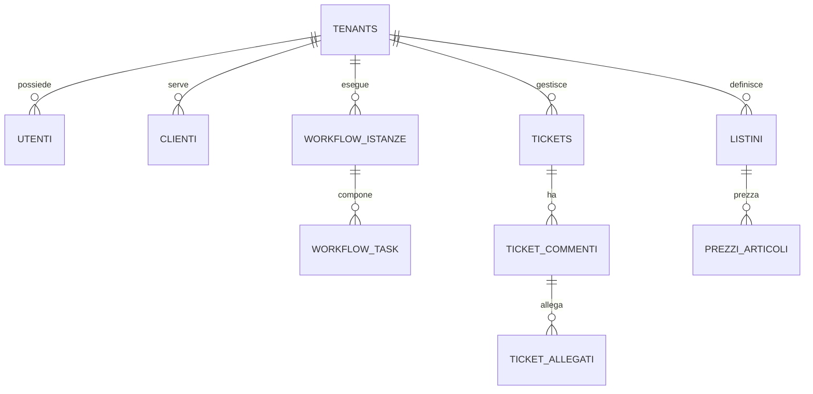
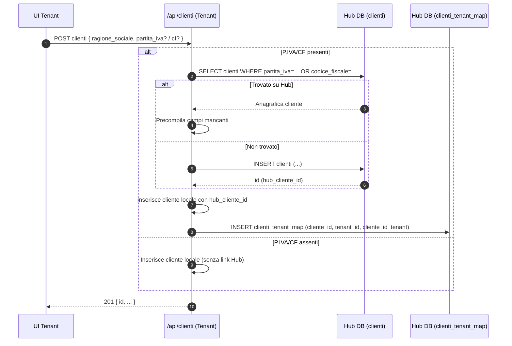

# Panoramica multi-tenant LPWF

La piattaforma LPWF eroga servizi ai propri clienti (Tenant). Ogni Tenant è isolato e gestisce a sua volta i propri clienti finali e le proprie risorse applicative.

- LPWF: autenticazione, API, servizi comuni, Hub Catalogo centrale (read-only, retrocompatibile)
- Tenant: utenti, clienti, workflow/task, ticket/commenti/allegati, catalogo locale, listini/prezzi
- Isolamento: dati e permessi scopiati per tenant; il tenant può consultare/importare dal Hub

```mermaid
flowchart TB
  LPWF[LPWF — Piattaforma] --> T1[Tenant 1]
  LPWF --> Tn[Tenant N]

  subgraph S1 [Tenant]
    direction TB
    U[Utenti]
    C[Clienti]
    W[Workflow / Task]
    TK[Ticket / Commenti / Allegati]
    CAT[Catalogo Tenant]
    L[Listini / Prezzi]
    DB[(DB per-tenant)]
  end

  Hub[Hub Catalogo\n(read-only, retrocompatibile)] -. consulta/importa .-> CAT

  subgraph HUB [Hub — Dati centralizzati]
    direction TB
    HART[Articoli]
    HCLI[Clienti]
    MAP[Mappe tenant]
  end

  HCLI -. dedup/pre-fill .-> C

  class HUB hub;

  classDef hub fill:#eef,stroke:#66f,color:#000;
  classDef tenant fill:#efe,stroke:#6c6,color:#000;
  class Hub hub;
  class S1 tenant;
```

Relazioni sintetiche (scopiatura per tenant):



Note:
- L'Hub Catalogo è centrale e rimane read-only; i tenant mappano/ingestono nel proprio dominio (retrocompatibilità garantita).
- Le API includono sempre il contesto del tenant (autenticazione e scoping dei dati).

## Flusso creazione cliente con dedup su Hub



– Un Tenant può anche essere Cliente (es. per fatturazione tra aziende): in Hub il cliente può avere `tenant_assoc_id` per collegare l’anagrafica al record del tenant.

Vedi anche: `docs/diagrammi/dedup-clienti.md` per la versione in flowchart (hard vs soft match).
